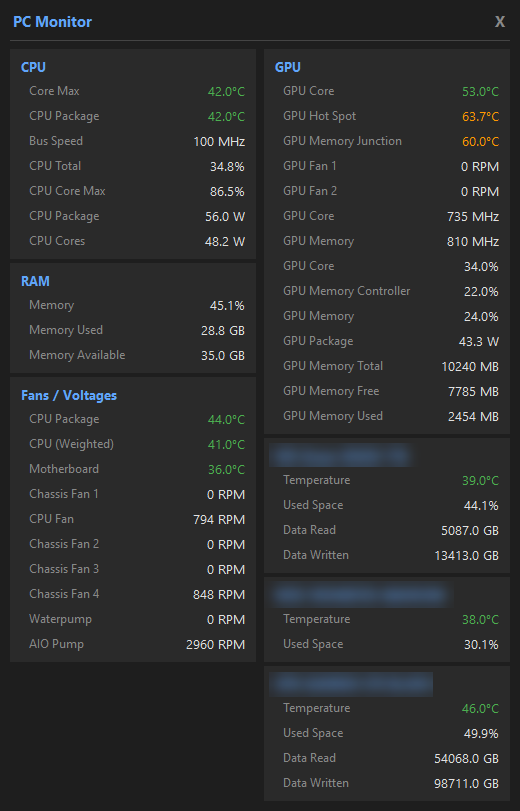

# Free PC Monitor

A lightweight Windows system tray application that displays real-time hardware temperatures, fan speeds, and system stats. Built with Python and [LibreHardwareMonitor](https://github.com/LibreHardwareMonitor/LibreHardwareMonitor).



## Features

- System tray icon showing CPU package temperature (color-coded)
- Two-column popup panel with grouped sensor data
- Dark theme UI
- Draggable popup with position memory
- Auto-refresh every second
- Per-drive storage stats

### Sensors Displayed

| Category | Readings |
|---|---|
| **CPU** | Package temp, Core Max temp, Bus Speed (BCLK), Total load, Power |
| **GPU** | Core temp, Hot Spot temp, Memory Junction temp, Core load, Fan RPMs, VRAM usage, Power |
| **RAM** | Usage %, Used/Available GB |
| **Fans / Voltages** | CPU Fan, AIO Pump, Chassis fans RPMs, Motherboard temp |
| **Storage** | Per-drive temperature, used space %, data read/written |

## Download

Grab the latest `PCMonitor.exe` from the [Releases](../../releases) page. No installation needed — just run it.

## Requirements

- **Windows 10/11** (64-bit)
- **Administrator privileges** (required for hardware sensor access)
- **.NET Framework 4.7.2+** (pre-installed on Windows 10 version 1803 and later)
- **[Visual C++ Redistributable 2015-2022](https://aka.ms/vs/17/release/vc_redist.x64.exe)** (most PCs have it; install if the exe fails to start)
- If using **Norton antivirus**, see [Norton Antivirus Users](#norton-antivirus-users) below

## Usage

### Option A: Run the exe (recommended)

1. Download `PCMonitor.exe` from [Releases](../../releases)
2. Double-click to run — accept the UAC admin prompt
3. Look for the temperature icon in the system tray (bottom-right, may be in the overflow `^` area)
4. Left-click the icon to open the sensor panel
5. Right-click for Refresh / Quit options
6. Drag the title bar to reposition the popup — position is saved between runs

### Option B: Run from source

1. Install Python 3.10+
2. Clone this repo and install dependencies:
   ```
   git clone https://github.com/AcierDev/Free-PC-Monitor.git
   cd Free-PC-Monitor
   pip install -r requirements.txt
   ```
3. Run as administrator:
   ```
   python main.py
   ```

### Auto-start on boot

```
python install_autostart.py          # enable
python install_autostart.py --remove # disable
```

### Build the exe yourself

```
pip install pyinstaller
python build.py
```

The exe will be at `dist/PCMonitor.exe`.

## How It Works

The app uses [LibreHardwareMonitor](https://github.com/LibreHardwareMonitor/LibreHardwareMonitor)'s .NET library (loaded via [pythonnet](https://github.com/pythonnet/pythonnet)) to read hardware sensors. This requires a kernel driver for CPU MSR registers and SuperIO chip access, which is why admin privileges are needed.

## Norton Antivirus Users

This app uses the **WinRing0** kernel driver (via LibreHardwareMonitor) to read CPU temperatures, clock speeds, fan RPMs, and other sensor data. Norton's **"Block vulnerable kernel drivers"** setting blocks this driver, causing CPU temps, fan speeds, and motherboard sensors to show as N/A.

**To fix this:**

1. Open Norton → **Settings** → **Product Tamper Protection** (expand it)
2. Turn **off** "Block vulnerable kernel drivers"
3. Launch PC Monitor
4. Once the app is running and showing sensor data, you can turn the setting **back ON** — the driver is already loaded and will continue working until the app is closed

You only need to disable it briefly during startup. The driver stays loaded in memory once initialized.

> **Why does Norton block it?** WinRing0 is on Microsoft's vulnerable driver blocklist because it provides low-level hardware access that could theoretically be exploited by malware. However, the risk is low on a personal PC — it's only exploitable if malicious software is already running as admin. HWiNFO and similar tools use their own signed drivers to avoid this, but that requires expensive code signing certificates.

## Troubleshooting

| Problem | Solution |
|---|---|
| CPU temps / fans show N/A | Norton is blocking the kernel driver — see [Norton Antivirus Users](#norton-antivirus-users) above |
| No tray icon visible | Click the `^` overflow arrow in the taskbar — Windows hides new tray icons by default |
| App silently closes on launch | Check `pc-monitor.log` in the app directory for errors |
| Fans show 0 RPM | GPU fans at 0 RPM is normal (zero-fan mode below ~50°C). Chassis fans at 0 RPM means they're not connected to those headers |

## License

MIT
